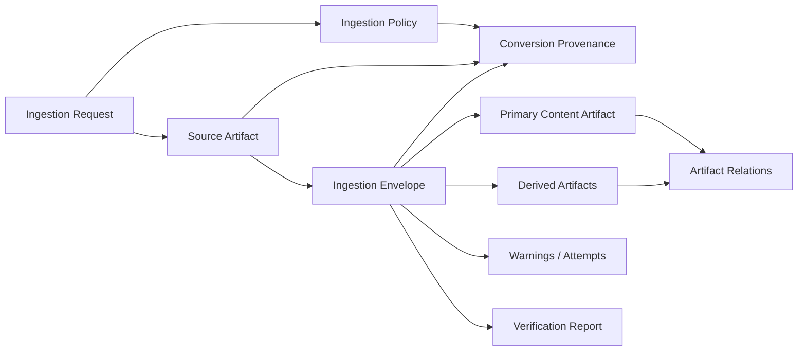
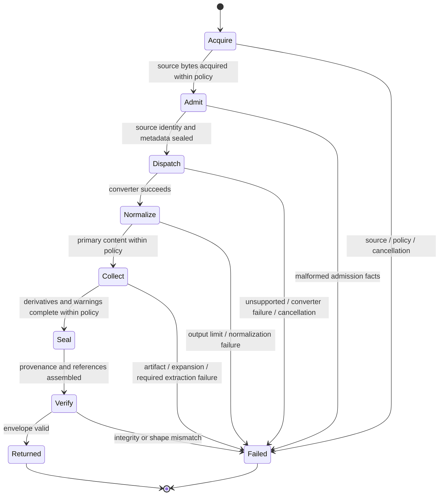

# Data Model: Inkbite Ingestion Contract

**Mission**: `inkbite-ingestion-contract-01M0M3HW`  
**Contract status**: conceptual model for planning; serialized field names are not fixed here.

## Model Overview

## Entities

### IngestionRequest

Represents one caller-authorized ingestion attempt.

| Attribute | Meaning | Invariant |
|---|---|---|
| source | Path, bytes, reader, seekable reader, file/data URI, or explicitly authorized HTTP(S) URI. | Exactly one source is present. |
| hints | Optional media type, extension, charset, filename, or other routing facts. | Hints do not alter the identity of actual source bytes. |
| policy | Immutable limits and authorities for this request. | Effective defaults are materialized before acquisition. |
| context | Cancellation and deadline signal. | Cancellation prevents a successful envelope. |

### IngestionEnvelope

The complete, versioned successful result.

| Attribute | Meaning | Invariant |
|---|---|---|
| contract_version | Semantic version of the detailed envelope contract. | Non-empty and supported by verification. |
| source | Exact acquired source artifact. | Exactly one; its identity anchors all relationships. |
| primary | Canonical normalized-content artifact. | Exactly one; role is primary content. |
| artifacts | Ordered derived artifact collection. | Zero or more; stable ordering and unique relation identity. |
| provenance | Deterministic conversion evidence. | Exactly one and bound to source, policy, and all outputs. |
| warnings | Ordered visible degradation records. | No silent skipped or failed detailed extraction. |

An envelope is valid only when every byte-bearing object, relationship, count, and provenance reference verifies. There is no `partial success` state in contract version 1.

### SourceArtifact

The exact bytes acquired before converter dispatch.

| Attribute | Meaning | Invariant |
|---|---|---|
| bytes | Immutable owned source payload. | Does not alias caller or scratch storage. |
| digest | `sha256:<lowercase hexadecimal>` over `bytes`. | Recomputes exactly. |
| byte_length | Number of bytes. | Equals actual byte length and policy permits it. |
| media_type | Canonical effective media type when known. | Contains no parameters or secrets. |
| source_kind | Stable category such as bytes, reader, file, data URI, or remote. | Does not expose raw payload. |
| safe_name | Optional sanitized display name. | No absolute path, control character, credential, query secret, or traversal segment. |

### ContentArtifact

One independently retainable output. The primary normalized Markdown and all derivatives use the same identity model.

| Attribute | Meaning | Invariant |
|---|---|---|
| artifact_id | Stable envelope-local relation identifier. | Unique and deterministic within one envelope. |
| role | Primary content or a defined derivative role. | Known contract value. |
| bytes | Immutable owned artifact payload. | Does not alias source, caller, or sibling scratch storage. |
| digest | `sha256:<lowercase hexadecimal>` over `bytes`. | Recomputes exactly. |
| byte_length | Number of bytes. | Equals actual length and policy permits it. |
| media_type | Canonical media type. | Non-empty for byte-bearing artifacts. |
| safe_name | Optional deterministic logical name. | Sanitized and not used as authority. |
| relations | Ordered relationships to source or another artifact. | Every target resolves inside the envelope. |
| attributes | Role-specific non-sensitive scalar facts. | Canonical keys/order; no arbitrary backend object. |

### ArtifactRelation

Explains where an artifact came from or how normalized content references it.

| Attribute | Meaning | Invariant |
|---|---|---|
| kind | Stable relation category such as derived-from, embedded-in, or referenced-by. | Known contract value. |
| from_id | Source digest or envelope-local artifact ID. | Resolves exactly once. |
| to_id | Envelope-local artifact ID. | Resolves exactly once. |
| occurrence | Deterministic source location such as page/object or archive path. | Safe, bounded, and optional when unavailable. |

Relationships distinguish identical byte payloads found at multiple source occurrences. Content deduplication, if selected, therefore does not erase provenance.

### ConversionProvenance

Canonical evidence describing how this envelope was produced.

| Attribute | Meaning | Invariant |
|---|---|---|
| contract_version | Detailed contract version. | Matches envelope. |
| source_digest | Exact source identity. | Matches source artifact. |
| converter | Winning converter identity. | Stable public identity. |
| backend | Selected converter backend when relevant. | Explicit; never inferred from host-local display text. |
| component | Explicitly selected optional component identity/version, if any. | Absent when no component was selected. |
| stream_facts | Ordered canonical metadata facts. | Each fact records value and origin. |
| policy | Fully materialized effective policy. | Contains no mutable pointer or secret transport state. |
| output_digests | Primary and derived identities in canonical order. | Exact one-to-one match with envelope artifacts. |
| attempts | Ordered safe converter attempt categories. | No raw backend stack or source content. |

Canonical provenance excludes time and environment observations. An operational wrapper may record time separately without changing the envelope's content identity.

### MetadataFact

One routing or descriptive fact.

| Attribute | Meaning | Invariant |
|---|---|---|
| kind | Media type, extension, charset, filename, or another registered fact. | Known key. |
| value | Canonical safe value. | Deterministic normalization. |
| origin | Caller hint, source fact, content sniff, or converter fact. | Exactly one origin. |
| precedence | Why this value became effective when facts conflict. | Stable rule, not an implementation trace. |

### IngestionPolicy

The immutable effective boundary for one request.

| Group | Attributes | Invariants |
|---|---|---|
| Acquisition | maximum source bytes | Positive, applied uniformly before dispatch. |
| Output | maximum primary bytes, artifact count, per-artifact bytes, aggregate artifact bytes | All enforced before success. |
| Containers | entry count, per-entry bytes, total expanded bytes, recursion depth, expansion ratio | Applied to generic and format-specific containers. |
| Remote | enabled schemes, redirects, destination admission, response bytes, caller transport capability | Disabled by default; each destination re-evaluated. |
| Components | selected installed component/backend | Empty by default; selection does not authorize installation. |
| Degradation | required derivative roles and warning/failure behavior | No silent authoritative omission. |

### WarningRecord

A visible non-fatal degradation allowed by policy.

| Attribute | Meaning | Invariant |
|---|---|---|
| category | Stable warning category. | Public and documented. |
| converter | Responsible converter identity when relevant. | Safe public identity. |
| location | Sanitized member or logical location. | No source bytes, credentials, or absolute paths. |
| detail | Bounded actionable summary. | No raw backend stack or secret sentinel. |

### Failure

No envelope accompanies a failure. Public categories include:

- invalid source;
- unsupported format;
- malformed input;
- source, expansion, output, or artifact limit;
- remote disabled or destination denied;
- component unavailable or unauthorized;
- integrity failure;
- cancellation/deadline; and
- converter failure.

Each failure is compatible with category matching without parsing its display text. Trusted internal causes may be wrapped but public formatting remains safe.

### VerificationReport

The outcome of pure envelope verification.

| Attribute | Meaning | Invariant |
|---|---|---|
| valid | Whether every required check passed. | False on any finding. |
| findings | Ordered typed structural or integrity findings. | Empty only when valid. |
| verified_source_digest | Recomputed source identity. | Present only after source bytes are hashed. |
| verified_artifact_digests | Recomputed artifact identities in canonical order. | No conversion or external call. |

## State Model

`Returned` and `Failed` are terminal. A failed request cannot expose an envelope from an earlier intermediate state.

## Canonical Ordering

1. The primary artifact is separate and precedes derivatives conceptually.
2. Derived artifacts sort by a format-neutral relation key, then role, safe logical name, digest, and deterministic occurrence discriminator.
3. Relations sort by source, target, kind, and occurrence.
4. Metadata facts sort by kind and origin precedence.
5. Attempts and warnings retain deterministic dispatch/source order with stable tie-breaking.
6. Maps are serialized with canonical key ordering by any future wire representation.

## Cross-Entity Invariants

1. `source.digest == provenance.source_digest`.
2. Primary plus derivative identities equal `provenance.output_digests` exactly and in order.
3. Every relation endpoint resolves inside the same envelope or to its source digest.
4. Every byte length and digest recomputes from owned bytes.
5. No artifact exceeds the effective policy alone or in aggregate.
6. No warning or metadata fact contains a configured secret sentinel.
7. An absent component in provenance implies zero optional-component calls.
8. Verification is pure: it cannot acquire, convert, infer, download, persist, or clean up.

## Host Durability Boundary

Inkbite returns the complete owned envelope. Nano Kitty or another host then:

1. independently verifies it;
2. atomically retains the exact source and selected artifacts under its own authority;
3. records the envelope/provenance binding;
4. confirms retained bytes are recoverable; and only then
5. removes disposable conversion or worker state.

Inkbite does not select the durable store, grant cleanup, or claim that a returned in-memory value has already been retained.
