# Implementation Plan: Inkbite Ingestion Contract

**Branch**: `feat/inkbite-ingestion-contract` | **Date**: 2026-08-22 | **Spec**: [spec.md](spec.md)  
**Input**: Committed mission specification, research, data model, source register, and project charter.

## Summary

Extend Inkbite with an additive `inkbite.ingestion/v1` envelope that returns owned source bytes, normalized Markdown, first-class derivatives, deterministic provenance, visible degradation, and pure verification. The existing `Result`, `Converter`, engine conversion methods, converter ordering, and Markdown-only CLI remain compatible. Legacy conversion and detailed ingestion share one engine pipeline and one fail-closed policy authority.

The implementation introduces bounded acquisition for every source form, connection-time-pinned HTTP admission, shared accounting for generic and format-specific ZIP containers, output/artifact budgets, and a PDF detailed-converter capability that returns embedded images as separate artifacts referenced with a non-network `inkbite-artifact:` URI. Nano Kitty remains the durable-storage and cleanup owner.

## Engineering Alignment

- **Invariant**: no successful envelope exists until exact source bytes, all selected outputs, effective policy, provenance, and references verify together.
- **Compatibility**: do not add methods to `Converter` or fields to the comparable two-string legacy `Result`; add a new operation and optional capability interface.
- **Authority**: remote access, proxies, transparent decompression, optional components, subprocesses, downloads, OCR, and inference remain disabled unless explicitly granted.
- **Durability**: Inkbite returns complete owned values; a host verifies and persists them before removing disposable state.
- **Failure**: policy, integrity, cancellation, malformed input, or required extraction returns a typed error and no envelope. Warning categories make permitted degradation visible.
- **Execution**: configuration precedes concurrent conversion; request state never crosses calls.

The user authorized autonomous end-to-end execution and reasonable defaults. No planning decision remains pending.

## Technical Context

**Language/Version**: Go 1.25.13 minimum; validation also uses Go 1.26.6 race tooling  
**Primary Dependencies**: Go standard library; existing `pdfcpu`, `dslipak/pdf`, `excelize`, HTML/charset, and XLS dependencies; optional `golang.org/x/exp/apidiff` as a release-only compatibility tool  
**Storage**: In-memory owned envelope only; no new durable store. Host persistence is outside Inkbite.  
**Testing**: Go unit/contract/integration tests, black-box public fixtures, red-green boundary tests, fixed-base changed-statement coverage, race stress, mutation/deletion evidence, cross-platform CI  
**Target Platform**: Linux, macOS, and Windows; pure-Go default binary on supported Go architectures  
**Project Type**: Single Go module with library root, CLI, built-in converter packages, and internal bounded-ingestion helpers  
**Performance Goals**: Deterministic 100-run repeatability; cancellation acknowledgement within one second at cooperative boundaries; no input/output allocation beyond configured limits plus one-byte overflow probes  
**Constraints**: 32 MiB default acquisition/output/aggregate budgets; 256 entries/artifacts; 8 MiB individual entry/artifact; depth four; 1000:1 aggregate expansion ratio; HTTP and components off by default; no hidden inference or downloads  
**Scale/Scope**: One additive envelope contract, one public verifier, twelve built-in format converters preserved, five ZIP-backed readers brought under common accounting, PDF image artifacts as the first rich derivative proof

## Charter Check

### Pre-design gate

| Charter rule | Plan response | Status |
|---|---|---|
| Test-first and black-box behavior | Each concern starts with a public or stable-boundary red test; security defects reproduce through pre-existing paths where possible. | Pass |
| PR-only, linear, independently reviewed | Mission stays on `feat/inkbite-ingestion-contract`; WPs use isolated lanes, small commits, independent reviewers, and a final PR. | Pass |
| Locality and boring modular design | New code is divided between root public contract, `internal/ingestion` policy helpers, and touched converters; no framework or service is introduced. | Pass |
| Explicit authority and fail-closed security | Common limits, pinned remote dialing, no implicit components, pure verification, and safe errors are architectural owners rather than caller conventions. | Pass |
| Living documentation | README/API examples, contract schema, quickstart, security boundaries, and adopted-component record ship with behavior. | Pass |
| MIT-compatible civic adoption | No copied implementation is planned; `ADOPTED_COMPONENTS.md` records intentional adoption separately from dependency inventory and preserves required notices. | Pass |
| Quality and portability gates | Normal/race/static/vulnerability/module/license/API/diff/coverage and Linux/macOS/Windows CI are mandatory. | Pass |

### Post-design recheck

The design adds no persistence, service, inference provider, downloader, or second converter registry. Cross-context translation is explicit: Inkbite owns conversion evidence; Nano Kitty owns durable retention. No charter exception is required.

## Architecture

```mermaid
flowchart LR
    Caller --> Legacy[Legacy Convert API]
    Caller --> Detailed[Detailed Ingest API]
    Legacy --> Pipeline[Shared ingestion pipeline]
    Detailed --> Pipeline
    Pipeline --> Acquire[Bounded source acquisition]
    Acquire --> Admit[Metadata and remote admission]
    Admit --> Registry[Existing converter registry]
    Registry --> LegacyConv[Legacy Converter]
    Registry --> DetailConv[Optional DetailedConverter]
    LegacyConv --> Seal[Normalize, account, seal]
    DetailConv --> Seal
    Seal --> Verify[Pure envelope verification]
    Verify --> Envelope[Owned ingestion envelope]
    Envelope --> Project[Legacy Result projection]
    Envelope --> Host[Nano Kitty retention boundary]
```



### Public contract seam

The root package adds:

- `Engine.Ingest(ctx, source, hints, IngestOptions) (IngestionEnvelope, error)`;
- versioned envelope, source, artifact, relation, provenance, policy, warning, attempt, identity, and verification types;
- `VerifyEnvelope(IngestionEnvelope) VerificationReport` and an error-returning convenience form if justified by usage;
- an optional `DetailedConverter` capability that embeds the existing converter contract and may return derivatives and safe provenance facts; and
- typed policy, integrity, remote-admission, artifact, and malformed-envelope errors compatible with `errors.Is`.

Existing conversion methods call the shared internal pipeline with the default policy and project only Markdown/title. They do not round-trip through JSON and do not invoke a second registry.

### Identity and serialization

- Identity format is `sha256:<64 lowercase hexadecimal characters>` over exact bytes.
- Contract identifier is `inkbite.ingestion/v1`.
- JSON encodes byte slices as base64 only when a host explicitly serializes the envelope; default CLI output remains Markdown.
- Canonical order uses slices, not behavior-bearing maps. Any attribute maps are normalized into sorted key/value facts before sealing.
- Detailed Markdown references derivatives as `inkbite-artifact:<artifact-id>`, where IDs are deterministic zero-padded occurrence identifiers such as `artifact-000001`.
- Digest equality proves byte integrity only; it does not grant origin or execution authority.

### Internal policy authority

`internal/ingestion` owns immutable effective policy, bounded reads, safe names/locations, content identity, per-request budget accounting, context checkpoints, and shared ZIP validation. A request-scoped internal state is propagated only inside the module so nested generic-ZIP conversions reuse the same expansion ledger.

The shared ZIP validator:

1. checks central-directory claims for early denial;
2. normalizes and rejects absolute, non-local, backslash, traversal, NUL, duplicate/colliding, symlink, and special-file entries;
3. reads accepted entries through EOF under `limit+1` accounting so overflow and checksum errors surface;
4. enforces entry, per-entry, aggregate, nested-count, recursion, and 1000:1 expansion-ratio budgets; and
5. returns stable ordinal/path facts without extracting to the filesystem.

Generic ZIP, EPUB, DOCX/PPTX OOXML, and XLSX preflight use this owner. XLSX may validate once and then pass the original bounded source to `excelize`; the duplicate decompression cost is accepted to keep authority out of the third-party library.

### Remote acquisition

The default remote client is built from an owned transport:

- `http` and `https` only; userinfo rejected;
- ambient proxies disabled;
- transparent compression disabled and `Accept-Encoding: identity`, so retained remote source bytes are the received representation bytes;
- redirect maximum ten, with every redirect re-admitted and sensitive headers removed;
- all resolved addresses canonicalized with IPv4-mapped IPv6 unmapped and checked against a maintained deny set based on IANA special-purpose registries;
- connection dialing pins an admitted IP while preserving the original hostname for TLS verification/SNI; and
- body bytes are streamed through the acquisition limit, treating content length only as an early hint.

An injected custom HTTP client remains an explicit trusted caller capability for compatibility and tests. It cannot be represented as the safe default in provenance; the envelope records that a caller transport was used. Size, URL shape, redirect URL, and diagnostic hygiene still apply around it.

### Detailed PDF artifacts

The PDF converter implements the optional detailed capability by reusing its current ordered image extraction. Detailed mode returns image bytes plus page/object metadata and renders `inkbite-artifact:` references. Legacy mode preserves current behavior, including optional inline data URIs when explicitly requested. The engine validates artifact names, MIME types, IDs, sizes, references, and bytes before success.

### Visible degradation

The detailed envelope records stable warning categories for unsupported container members, optional extraction failures allowed by policy, converter fallback, and deduplication. Required derivative roles or security/integrity failures remain terminal. Legacy Markdown continues its current best-effort projection, but hosts requesting evidence use `Ingest` and cannot receive silent authoritative omission.

## Project Structure

### Documentation (this mission)

```text
kitty-specs/inkbite-ingestion-contract-01M0M3HW/
├── spec.md
├── plan.md
├── research.md
├── data-model.md
├── quickstart.md
├── checklists/requirements.md
├── contracts/
│   ├── ingestion-envelope-v1.schema.json
│   └── public-api.md
├── research/
│   ├── evidence-log.csv
│   └── source-register.csv
└── tasks.md
```

### Source code (repository root)

```text
.
├── engine.go / engine_test.go
├── source.go / source_test.go
├── result.go
├── converter.go
├── errors.go
├── ingestion.go / ingestion_test.go               # additive public operation
├── ingestion_model.go / ingestion_model_test.go   # envelope and verification
├── ingestion_policy.go / ingestion_policy_test.go # public immutable policy
├── internal/ingestion/
│   ├── bounded.go / bounded_test.go
│   ├── budget.go / budget_test.go
│   ├── container.go / container_test.go
│   └── sanitize.go / sanitize_test.go
├── internal/ooxml/package.go / package_test.go
├── converters/
│   ├── zip/zip.go / zip_test.go
│   ├── epub/epub.go / epub_test.go
│   ├── xlsx/xlsx.go / xlsx_test.go
│   ├── docx/docx_test.go
│   ├── pptx/pptx_test.go
│   └── pdf/pdf.go / pdf_test.go
├── cmd/inkbite/main.go / main_test.go
├── test/contract/ingestion_contract_test.go
├── test/acceptance/retained_ingestion_test.go
├── README.md
├── ADOPTED_COMPONENTS.md
└── .github/workflows/ci.yml
```

**Structure decision**: Preserve the single Go module and existing converter packages. Put reusable trust mechanics in one internal package, while public contract/value types stay at the module root. Add black-box contract/acceptance packages only where internal-package tests would weaken the external-behavior proof.

## Compatibility and Migration

1. Freeze the mission base and use `apidiff` against it for the exported API gate.
2. Add compile fixtures for an external custom `Converter`, unkeyed legacy `Result` literal, equality comparison, and map-key use.
3. Keep the legacy `Result` two-string and comparable.
4. Keep `ConvertOptions` source compatible; new policy belongs to `IngestOptions`.
5. Keep default CLI stdout and exit semantics; detailed JSON or artifact export is not added in this mission.
6. Update README with additive adoption examples and explicit untrusted-content/retention responsibility.

The security change that legacy local/readers now receive the default 32 MiB bound is intentional and documented. Callers needing a larger bounded source use detailed ingestion with an explicit policy rather than an unbounded legacy escape hatch.

## Test and Gate Strategy

### Red-first behavior layers

- **Contract red**: old bytes cannot return exact source/artifact/provenance evidence through one operation.
- **Acquisition red**: paths/readers/bytes/data URIs over 32 MiB reach converter dispatch today.
- **Remote red**: default HTTP admission can reach special destinations, ambient proxies, compression, or redirect targets.
- **Container red**: EPUB/OOXML/XLSX can exceed generic ZIP limits; duplicate/traversal/checksum cases are not uniformly denied.
- **Artifact red**: PDF images exist only inline and cannot be retained or independently verified.
- **Integrity red**: one-byte mutations, missing references, duplicate IDs, cross-envelope substitution, and reordered canonical facts are accepted absent a verifier.
- **Cancellation/redaction red**: non-cooperative paths or raw source locations can outlive or leak past the public failure boundary.

Each red is committed before its production correction. Deletion/mutation of each central guard must make the corresponding test fail for the intended observable reason.

### Required final gates

1. Focused unit and contract suites, normal count 100 and race count 10 for identity, verifier, budget, remote admission, and container invariants.
2. Black-box retained-ingestion journey count 20 and race count 5.
3. Full `go test ./...` and full `go test -race ./...` with serialized `-p=1` evidence where installed-host/process fixtures require isolation.
4. At least 80.0% unrounded fixed-base changed-production coverage; no new exclusion.
5. `gofmt`, `go vet`, current pinned `staticcheck`, `govulncheck`, `go mod verify`, dependency/license checks, and generated-output/diff checks.
6. `apidiff` plus compile compatibility fixtures.
7. Linux, macOS, and Windows CI including a fresh `core.autocrlf=true` checkout for byte fixtures.
8. Exact allowed-file/scope audit and no secret-sentinel output.

## Implementation Concern Map

### IC-01 — Additive envelope and verification

- **Purpose**: Define the versioned owned-value contract, canonical identities/order, typed findings, and pure verification without changing legacy result/interface comparability.
- **Relevant requirements**: FR-001–FR-006, FR-011–FR-014, FR-017; NFR-001, NFR-002, NFR-008, NFR-009; C-004, C-006, C-007.
- **Affected surfaces**: `ingestion.go`, `ingestion_model.go`, `ingestion_policy.go`, `converter.go`, `engine.go`, `errors.go`, contract schema/tests.
- **Sequencing/depends-on**: none.
- **Risks**: accidental public API break, aliased bytes, nondeterministic order, verifier performing effects, legacy projection divergence.

### IC-02 — Uniform bounded acquisition and remote authority

- **Purpose**: Apply one source limit to every encoding and make the safe default HTTP path resistant to redirects, special destinations, DNS rebinding, proxies, compression ambiguity, and sensitive diagnostics.
- **Relevant requirements**: FR-007, FR-009, FR-011, FR-015; NFR-003, NFR-005, NFR-007, NFR-011; C-003.
- **Affected surfaces**: `source.go`, `options.go`, `engine.go`, `internal/ingestion/bounded.go`, remote/source tests.
- **Sequencing/depends-on**: IC-01 policy and provenance model.
- **Risks**: TOCTOU between DNS and dial, IPv4-mapped IPv6 bypass, breaking injected-client tests, implicit body decompression, cancellation without worker join.

### IC-03 — Shared container accounting

- **Purpose**: Close archive expansion and path/integrity bypasses uniformly across generic ZIP, EPUB, OOXML, and XLSX while preserving converter fidelity.
- **Relevant requirements**: FR-008, FR-011, FR-015, FR-016; NFR-004, NFR-007, NFR-013.
- **Affected surfaces**: `internal/ingestion/container.go`, `internal/ooxml/package.go`, `converters/zip`, `converters/epub`, `converters/xlsx`, DOCX/PPTX fixtures.
- **Sequencing/depends-on**: IC-01 policy; may proceed in parallel with IC-02 after model freeze.
- **Risks**: double accounting in nested conversion, duplicate paths, trusting declared sizes, checksum not read, legitimate high-ratio documents, third-party XLSX decompression.

### IC-04 — First-class PDF derivatives

- **Purpose**: Prove the rich-artifact contract by returning deterministic embedded PDF image artifacts and non-network Markdown references while retaining legacy inline behavior.
- **Relevant requirements**: FR-003, FR-004, FR-006, FR-015, FR-016; NFR-001, NFR-002, NFR-013.
- **Affected surfaces**: `converters/pdf/pdf.go`, PDF tests, detailed-converter capability, envelope sealing/reference validation.
- **Sequencing/depends-on**: IC-01.
- **Risks**: duplicate image bytes vs occurrences, output/artifact amplification, unstable PDF object ordering, default Markdown regression.

### IC-05 — Compatibility, documentation, and civic adoption

- **Purpose**: Preserve current callers and CLI behavior, document the durability/security boundary, and establish an auditable adopted-component record.
- **Relevant requirements**: FR-012, FR-013; NFR-008, NFR-012; C-001, C-008; SC-006–SC-008.
- **Affected surfaces**: compile fixtures, `cmd/inkbite`, README, quickstart/contracts, `ADOPTED_COMPONENTS.md`, CI.
- **Sequencing/depends-on**: IC-01 contract freeze; docs finish after IC-02–IC-04 behavior.
- **Risks**: overlooked comparability break, inaccurate examples, conflating dependencies with adopted source, missing license notice.

### IC-06 — Aggregate retained-ingestion acceptance

- **Purpose**: Demonstrate that a host can ingest, verify, persist, discard converter state, reload exact source/content/derivatives, and observe zero hidden component or network authority.
- **Relevant requirements**: all functional requirements; NFR-001–NFR-013; C-002, C-003.
- **Affected surfaces**: `test/contract`, `test/acceptance`, cross-platform fixtures, final gate scripts.
- **Sequencing/depends-on**: IC-01–IC-05.
- **Risks**: test-only persistence substituting for public verification, in-process aliases masking durability failure, fixture timing, uncredited subprocess coverage.

## Complexity Tracking

No charter violation requires justification. The optional detailed-converter interface and shared internal ingestion package are the minimum structural additions that preserve public compatibility while closing common trust boundaries. A second service, plugin framework, persistence layer, or provider abstraction is explicitly rejected.

## Phase Outputs

- Phase 0 research: [research.md](research.md), [data-model.md](data-model.md), [research/evidence-log.csv](research/evidence-log.csv), [research/source-register.csv](research/source-register.csv)
- Phase 1 contracts: [contracts/ingestion-envelope-v1.schema.json](contracts/ingestion-envelope-v1.schema.json), [contracts/public-api.md](contracts/public-api.md)
- Phase 1 integration guide: [quickstart.md](quickstart.md)

Task generation must preserve the concern boundaries, independent review, red-first commits, and dependency order. Work packages may combine small concerns or split high-risk ones, but overlapping production ownership is prohibited.
